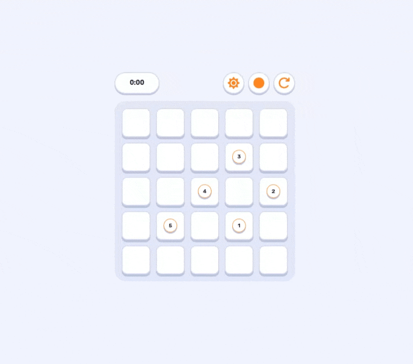

# Mik

Mik is a small, polished puzzle game built with Vue, TypeScript, Pinia, and Tailwind CSS. The goal is to connect the numbered cells in the correct order while filling the entire board with a continuous path.

The game focuses on quick rounds, tactile interactions, smooth path drawing, and a playful interface that works on both desktop and mobile.

## Gameplay Preview



## Features

- 5x5 path-building puzzle board
- Numbered checkpoints that must be connected in order
- Animated path drawing with an active cursor
- Game timer with level completion tracking
- Complete-level dialog
- Light and dark mode support
- Dynamic accent color switching
- Responsive board scaling for mobile screens
- Touch-friendly pointer controls

## Tech Stack

- Vue 3
- TypeScript
- Pinia
- Tailwind CSS 4
- Vite
- Vitest

## Getting Started

Install dependencies:

```bash
npm install
```

Run the development server:

```bash
npm run dev
```

Build for production:

```bash
npm run build
```

Preview the production build:

```bash
npm run preview
```

## Quality Checks

Run type checking:

```bash
npm run type-check
```

Run unit tests:

```bash
npm run test:unit
```

Run the production build only:

```bash
npm run build-only
```

## Project Structure

```text
src/
  mod/
    game/
      application/   Game command actions
      domain/        Core game types and models
      presentation/  Game views and widgets
      store/         Pinia game state
  shared/
    application/     Shared application logic
    presentation/    Reusable UI components
```

## Notes

The project keeps UI components and container components separate where it matters. UI components focus on rendering and local interaction, while containers connect them to application commands and store state.
